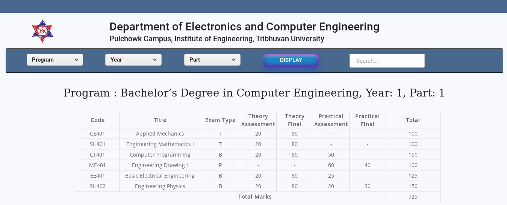

# Python Django Postgresql

## SETUP
   - [x] Create a virtual env, for dependency issues use python 3.7.1  
   	* `$ python3 -m venv dependency_env`

   - [x] Activate virtualenv
	* `$ source dependency_env/bin/activate`

   - [x] Virtual_env package reqirements
	* `$ pip install -r requirements.txt`

### For running services create a user...
> according to settings use credentials file for user and password... 
> also create a database in postgresql...
> for simplicity use data_entry as database name...

   - [x] Create system User
	* `$ useradd user_name`

   - [x] Create database in postgres

### Django  
 * `$ python3 manage.py makemigrations`  
 * `$ python3 manage.py migrate`  
 * `$ python3 manage.py runserver`  

## TODO

### Html files are located inside templates...
   - [ ] Maintaining frontEnd

### API
   - [ ] API Documentation

### Masters and Bachelors dependency
   - [ ] Entry
   - [ ] Views

### PDF Download
   - [ ] PDF

 

